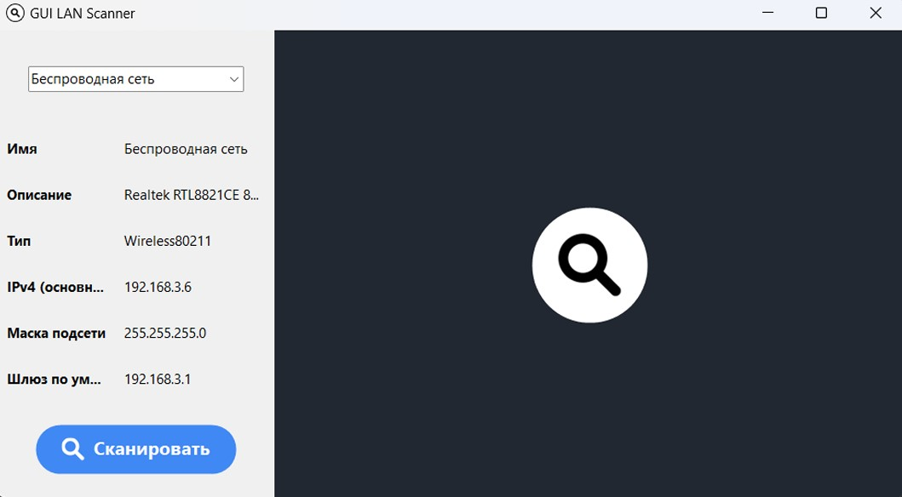
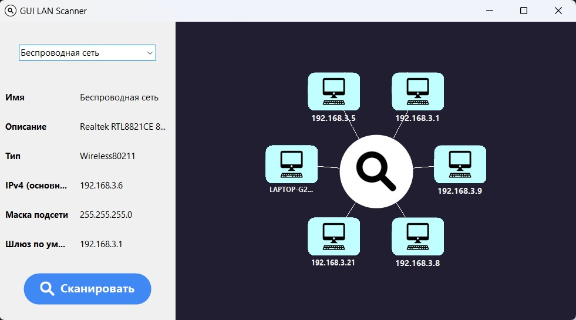
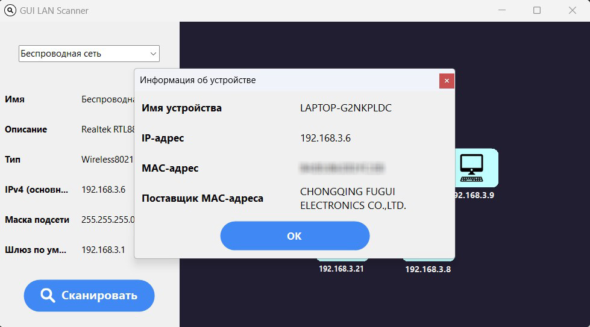
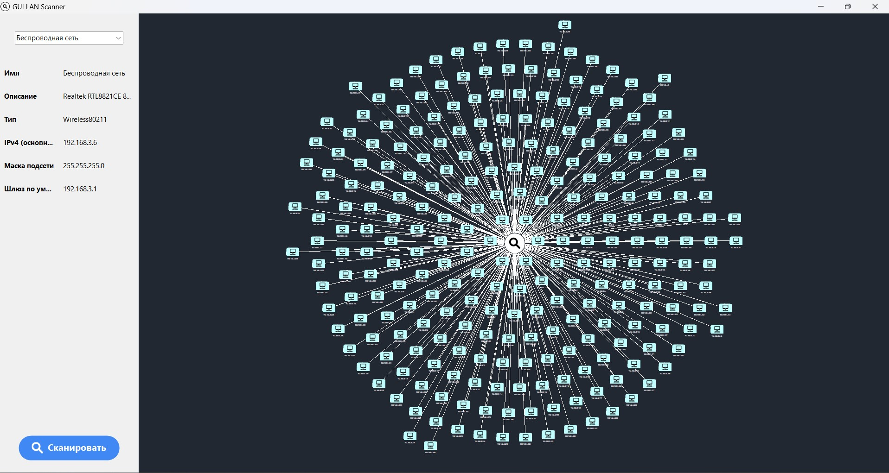

# LAN Scanner with GUI

Простой и удобный графический инструмент для сканирования локальной сети на основе Windows Forms. Позволяет обнаруживать активные устройства, их MAC-адреса и, по возможности, производителей и имена.

---



---

## 📌 Описание проекта

- **Автоматическое обнаружение активных локальных сетей для сканирования**:
  - Получение всех активных сетевых интерфейсов на ПК
  - Фильтрация по частным IPv4-диапазонам (`10.x.x.x`, `172.16–31.x.x`, `192.168.x.x`)
  - Фильтрация по наличию шлюза по умолчанию
  - Фильтрация по физическим (`Ethernet`) и беспроводным (`Wireless802.11`) адаптерам

- **Сканирование сети**:
  - Отправка ICMP-запросов (Ping) для определения активных хостов
  - Чтение и анализ ARP-таблицы
  - Дополнительная отправка ARP-запросов для более точного обнаружения активных устройств

- **Дополнительная информация об устройствах**:
  - Обратное DNS-разрешение имён хостов
  - Определение производителя сетевого оборудования по MAC-адресу (на основе заранее спарсенной базы OUI)

- **Удобный графический интерфейс**:
  - Отображение результатов сканирования на графической сцене.
  - Возможность просмотра данных об устройстве.

---

## 🛠 Используемое окружение

- **Операционная система**: Windows 11
- **Среда разработки**: Visual Studio 2022
- **Модуль**: Windows Forms 
- **Целевая платформа**: .NET 9.0

---

## 📦 Сборка проекта

### Способ №1. Через Visual Studio

1. Клонируйте репозиторий:
   ```bash
   git clone https://github.com/afrlfff/lan-scanner-with-gui.git
   cd lan-scanner-with-gui
   ```

2. Откройте решение в **Visual Studio 2022**:
   - Файл → Открыть → Проект/Решение → выберите `lan-scanner.sln`

4. Соберите проект:
   - **Сборка → Собрать решение** (или нажмите `Ctrl+Shift+B`)

5. Запустите приложение:
   - Нажмите `F5` или выберите **Отладка → Запуск без отладки**

### Способ №2. Через dotnet

1. Клонируйте репозиторий:
   ```bash
   git clone https://github.com/afrlfff/lan-scanner-with-gui.git
   cd lan-scanner-with-gui
   ```

2. Восстановить зависимости (обычно необязательно — `build` делает это автоматически, но полезно при первом запуске):

   ```bash
      dotnet restore
   ```

3. Собрать проект:

   ```bash
   dotnet build -c Release
   ```

4. Запустить приложение:

   ```bash
   dotnet run
   ```

---

## 🧪 Использование

1. Запустите приложение.
2. Программа автоматически определит доступные локальные сетевые интерфейсы и отобразит их в выпадающем списке.
3. Выберите нужный интерфейс.
4. Нажмите кнопку **"Сканировать"** (либо на кнпоку на графической сцене).
5. Дождитесь завершения сканирования — на графической сцене отобразятся найденные устройства, нажав на которые можно будет посмотреть:
   - IP-адрес
   - Имя хоста (если разрешено через обратный DNS)
   - MAC-адрес
   - Производитель устройства (по OUI)

---

## 🖼️ Скриншоты





